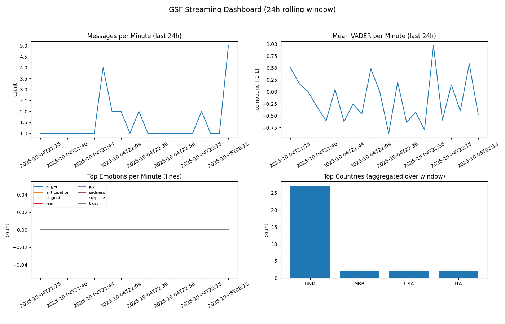

# Global Sumud Flotilla: Real-Time Reddit Emotion and Country Reaction Pipeline  
**Repository:** `buzzline-05-strickland`  

---

## Project Overview  

This project implements a **custom real-time data pipeline** using **Reddit, Kafka, SQLite, and Matplotlib** to monitor global discussions about the **Global Sumud Flotilla**.  

It continuously streams Reddit comments, detects **emotions and sentiment**, identifies **countries of reference** via linked news outlets, and updates a **live visualization dashboard** that reveals emotional trends and geographic engagement in real time.  

---

##  Insight Focus  

> **Goal:**  
> To explore how global audiences emotionally respond to the Global Sumud Flotilla event and which **countries/outlets** are most involved in the online conversation.  

The pipeline enriches Reddit comment data by combining:
- **VADER Sentiment Analysis** → measures tone from –1 (negative) to +1 (positive)  
- **NRC Emotion Lexicon** → identifies emotions such as joy, fear, anger, and trust  
- **TLD + Outlet Mapping** → infers countries from shared link domains (e.g., `.uk`, `.de`, `nytimes.com`)  

Together, this creates a **real-time emotional and geographic snapshot** of Reddit activity related to the flotilla.  

---

##  Pipeline Summary  

Here’s what happens *for every incoming Reddit comment*:  

1. **Producer – `producers/reddit_gsf_producer.py`**  
   - Connects to Reddit’s API with PRAW.  
   - Searches for flotilla-related keywords.  
   - Extracts comment text, URLs, and outbound link domains.  
   - Uses `tldextract` and a custom **outlet-country map** to infer the country of reference.  
   - Builds a structured JSON message such as:  

     ```json
     {
       "source": "comment",
       "id": "t1_hsy7ax3",
       "utc_ts": "2025-10-04T16:15:00Z",
       "subreddit": "worldnews",
       "permalink": "https://www.reddit.com/r/worldnews/comments/...",
       "author": "User123",
       "text": "Incredible footage from the flotilla...",
       "urls": ["https://bbc.co.uk/news/world-..."],
       "url_domains": ["bbc.co.uk"],
       "country": "GBR",
       "score": 85
     }
     ```

2. **Kafka Broker**  
   - Streams each JSON message in real time, allowing the consumer to process continuously.  

3. **Consumer – `consumers/reddit_gsf_consumer.py`**  
   - Subscribes to the Kafka topic (or tails the fallback JSONL file).  
   - Applies **VADER sentiment** and **NRC emotion detection** to each comment.  
   - Updates a **24-hour rolling window** (1,440 minute bins) of aggregated data:  
     - Total messages per minute  
     - Average sentiment score  
     - Emotion frequencies  
     - Country counts  
   - Periodically writes aggregates to `data/gsf.sqlite` for persistence.  

4. **Live Visualization (Matplotlib)**  
   - Continuously updates four live charts:  
     -  Messages per Minute  
     -  Mean Sentiment (VADER)  
     -  Emotions over Time  
     -  Top Countries Mentioned  
   - (Module 7) A Plotly choropleth can visualize country counts on a world map.  
```bash

```

---

##  System Components  

| Component | File Path | Description |
|------------|------------|-------------|
| **Producer** | `producers/reddit_gsf_producer.py` | Streams Reddit comments as JSON messages. |
| **Outlet Map** | `producers/outlet_country_map.py` | Maps known news outlets to ISO-3 country codes. |
| **Country Helper** | `utils/utils_country.py` | Determines country from domain, TLD, or NER fallback. |
| **Consumer** | `consumers/reddit_gsf_consumer.py` | Processes live data, applies sentiment/emotion analysis, updates aggregates. |
| **Visualization** | (Matplotlib dashboard) | Displays live charts that refresh every few seconds. |
| **Database** | `data/gsf.sqlite` | Stores rolling 24-hour aggregates for later analysis. |

---

##  Setup & Run Instructions  

### Environment Setup  

```bash
# clone the repository
git clone https://github.com/yourusername/buzzline-05-strickland.git
cd buzzline-05-strickland

## Task 0. If Windows, Start WSL

Launch WSL. Open a PowerShell terminal in VS Code. Run the following command:

```powershell
wsl
```

You should now be in a Linux shell (prompt shows something like `username@DESKTOP:.../repo-name$`).

Do **all** steps related to starting Kafka in this WSL window.

---

## Task 1. Start Kafka (using WSL if Windows)

In P2, you downloaded, installed, configured a local Kafka service.
Before starting, run a short prep script to ensure Kafka has a persistent data directory and meta.properties set up. This step works on WSL, macOS, and Linux - be sure you have the $ prompt and you are in the root project folder.

1. Make sure the script is executable.
2. Run the shell script to set up Kafka.
3. Cd (change directory) to the kafka directory.
4. Start the Kafka server in the foreground. Keep this terminal open - Kafka will run here.

```bash
chmod +x scripts/prepare_kafka.sh
scripts/prepare_kafka.sh
cd ~/kafka
bin/kafka-server-start.sh config/kraft/server.properties
```

**Keep this terminal open!** Kafka is running and needs to stay active.

For detailed instructions, see [SETUP_KAFKA](https://github.com/denisecase/buzzline-02-case/blob/main/SETUP_KAFKA.md) from Project 2. 

---

## Task 2. Manage Local Project Virtual Environment

Open your project in VS Code and use the commands for your operating system to:

1. Create a Python virtual environment.
2. Activate the virtual environment.
3. Upgrade pip and key tools. 
4. Install from requirements.txt.

### Windows

Open a new PowerShell terminal in VS Code (Terminal / New Terminal / PowerShell).
**Python 3.11** is required for Apache Kafka. 

```powershell
py -3.11 -m venv .venv
.\.venv\Scripts\Activate.ps1
py -m pip install --upgrade pip wheel setuptools
py -m pip install --upgrade -r requirements.txt
```

If you get execution policy error, run this first:
`Set-ExecutionPolicy -ExecutionPolicy RemoteSigned -Scope CurrentUser`

### Mac / Linux

Open a new terminal in VS Code (Terminal / New Terminal)

```bash
python3 -m venv .venv
source .venv/bin/activate
python3 -m pip install --upgrade pip
python3 -m pip install --upgrade -r requirements.txt
```
One time download (manual)
```bash

    python -m nltk.downloader vader_lexicon
```
---

## Task 3. Run Tests and Verify Emitters

In the same terminal used for Task 2, we'll run some tests to ensure that all four emitters are working fine on your machine.  All tests should pass if everything is installed and set up correctly. 

```shell
pytest -v
```

Then run the `verify_emitters.py` script as a module to check that we can emit to all four types. 
For the Kakfa sink to work, the Kafka service must be running. 

### Windows Powershell

```shell
py -m verify_emitters
```

### Mac / Linux

```shell
python3 -m verify_emitters
```

---

## Task 4. Start a New Streaming Application

This will take two terminals:

1. One to run the producer which writes messages using various emitters. 
2. Another to run each consumer. 

### Producer Terminal (Outputs to Various Sinks)

Start the producer to generate the messages. 

The existing producer writes messages to a live data file in the data folder.
If the Kafka service is running, it will try to write the messages to a Kafka topic as well.
For configuration details, see the .env file. 

In VS Code, open a NEW terminal.
Use the commands below to activate .venv, and start the producer. 

Windows:

```shell
.\.venv\Scripts\Activate.ps1
py -m producers.reddit_gsf_producer
```

Mac/Linux:
```zsh
source .venv/bin/activate
python3 -m producers.reddit_gsf_producer
```

NOTE: The producer will still work if the Kafka service is not available.

### Consumer Terminal (Various Options)

Start the associated consumer. 

In VS Code, open a NEW terminal in your root project folder. 
Use the commands below to activate .venv, and start the consumer. 

Windows:
```shell
.\.venv\Scripts\Activate.ps1
py -m consumers.reddit_gsf_consumer
```

Mac/Linux:
```zsh
source .venv/bin/activate
python3 -m consumers.reddit_gsf_consumer
```

---

### Bonus: Country Sentiment Choropleth (Plotly)

In addition to the Matplotlib dashboard, this project includes an **interactive world map** that shades each country by its **average sentiment (VADER)** and shows **message counts** on hover.

Generate the map from the SQLite aggregates:

```bash
python -m viz.choropleth_country_sentiment
```
  This produces an html file:
    images/gsf_choropleth.html


## Notes & tips

- **Accuracy:** Because the consumer stores only **minute-level means** (not every raw message), this script computes country sentiment by **weighting each minute’s mean** by that minute’s country counts. That’s statistically equivalent to the per-message mean if the minute mean is computed across all messages (which it is).
- **Live updates:** Re-run the script anytime; it refreshes from `gsf.sqlite`. If you want it to auto-refresh, you could wrap it in a small loop that runs every few minutes.
- **Color scale:** `RdBu` is centered at `0` so negative sentiment is red, positive is blue. You can change the scale in `color_continuous_scale`.